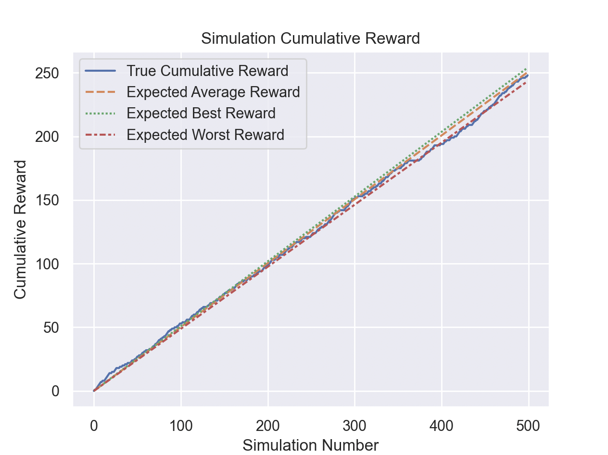
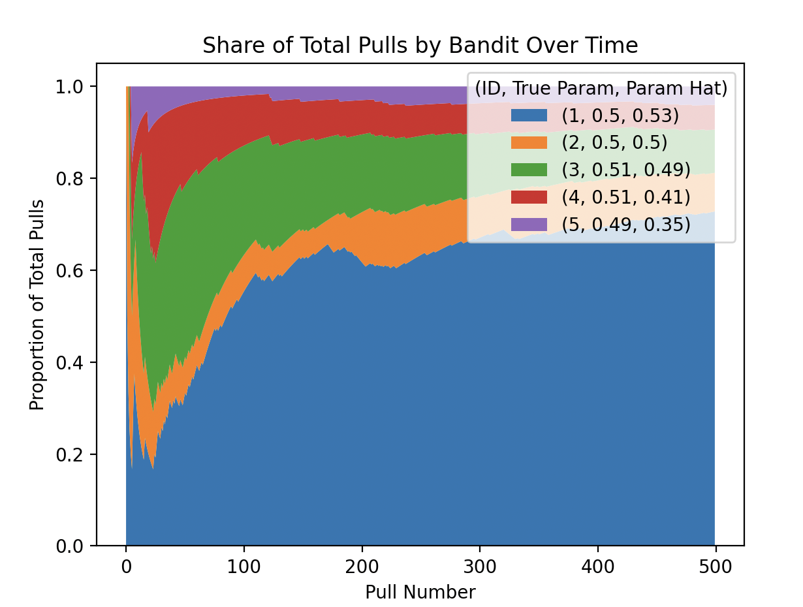
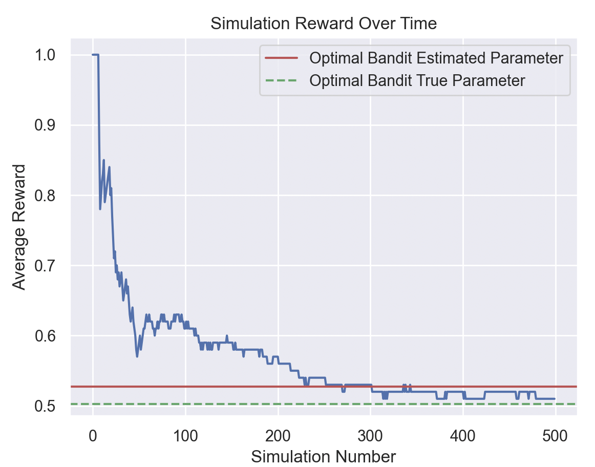
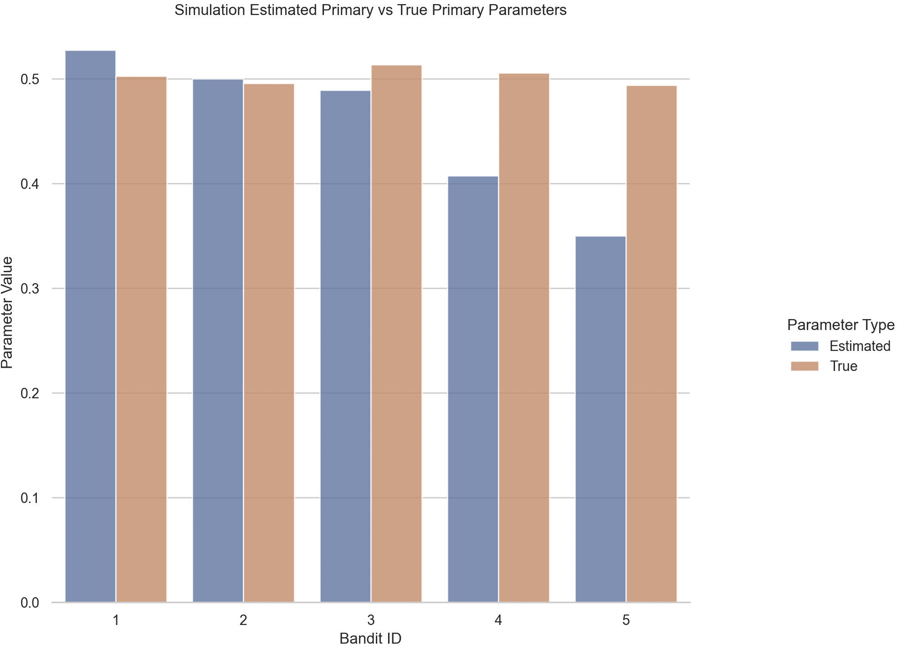

<h1 align="center">
Multi Armed Bandits (MAB).
</h1>

The multi-armed bandit problem is a classic dilemma in probability theory and decision-making, often used to model situations where one must balance exploration (trying new options) and exploitation (leveraging known options). The name "multi-armed bandit" originates from the analogy of a gambler facing multiple slot machines (bandits), each with potentially different payoff probabilities. The objective is to maximize cumulative reward over time while facing uncertainty about which action (or bandit arm) yields the highest reward.

In its basic form, a player repeatedly chooses from a set of arms, each with an unknown reward distribution, and receives a stochastic reward associated with the chosen arm. The challenge lies in deciding which arm to pull at each step to maximize cumulative reward, taking into account the trade-off between exploring new arms to gather information and exploiting arms with potentially higher expected rewards based on current knowledge.

<h2  align="center">
Methods Overview
</h2>

A study consistes of a collection of bandits, $`B = \{b_1, ..., b_n\}`$, where a bandit, $`b_i`$ has an associated parameter (or two parameters) that are within the exponential family of distributions. Thus, we have a collection $\theta = \{\theta_1, ..., \theta_n\}`$ of parameters (for the sake of two parameter distribution (e.g Gaussian), we refer to the primary parameter (\mu) as this single parameter).

When 'pulling' a bandit, we are generating a random variable from this bandit's distribution. For example, if generating a random variable from bandit $`i`$ that follows a Poisson distribution, we denote this $`X_i \thicksim Pois(\theta_i)`$. 'Payout' or 'reward' is what we call this generated random variable, $`x_i`$, and it what we wish to maximize. In the case of gambling machines, it could be a 'win' (Bernoulli), or some form of `monetary payout` (Gaussian).

We therefore wish to find the `optimal bandit` to exploit; or in other words the bandit with the highest parameter: $`\tilde{\theta} = max(\{\theta_1, ..., \theta_n\})`$. 

There is a second constraint however, that is doing this using the fewest generations (bandit pulls) as possible. Reasons for this include being able to maximize cumulative reward, given a fixed number of generations (e.g if there is a time constraint), or generating may have another associated cost (e.g paying for each armed bandit pull).

The problem can therefore be encapsulated as: Given a fixed number of generations, $`g`$; $`(1,..., g, ..., G)`$, maximizing cumulative reward: $`\sum^{G}x_g`$. This can be done by a number of different strategies - and all include some relation to balancing *exploration* (trying to accurately estimate each parameter $`\{\hat{\theta}_1, ..., \hat{\theta}_n \}`$), with *exploration* (the cumulative reward gained by just generating from the optimal bandit $`\tilde{\theta}`$).

<h2  align="center">
Usage
</h2>

<h3  align="center">
Running Simulations
</h3>

Options exist for simulating both directly using the command line, or via passing a configuration file in the form of JSON. The second is recommended for reproducable simulation studies.

To see all possible simulation commands run
```bash
just help
```

or help for a specific command:
```bash
just {{COMMAND}} help
```

e.g:
```bash
just list-distributions help
```

To view possible distributions, and information about their associated parameters, run:

```bash
just list-distributions
```

<h4 align="center">
Simulating directly
</h4>

<p align="center">

To run a simulation by passing arguments directly, run:

```bash
just {{COMMAND}} {{*ARGS}}
```

Where `COMMAND` is a command returned from `just help`, and args are those required
by a specific command upon running `just {{COMMAND}} help`.
</p>

<h4 align="center">
Simulating from config (json) file
</h4>

<p align="center">

There is the option to perform a MAB simulation, reading arguments and configuration from a config file.
To perform this simulation, run:

```bash
just simulate-from-json {{COMMAND}} {{CONFIG}}
```
</p>

<h3  align="center">
Testing
</h3>

To run all unit and integration tests in the repository, execute:

```bash
just local-test
```

<h2 align="center">
Sample Outputs
</h2>

<p align="center"> Metrics from the simulations are output to stdout. </p>
<p align="center">

</p>

<p align="center"> Plots are also optionally produced, detailing the the performance of the simulation. </p>
<p align="center">


</p>

<p align="center">


</p>