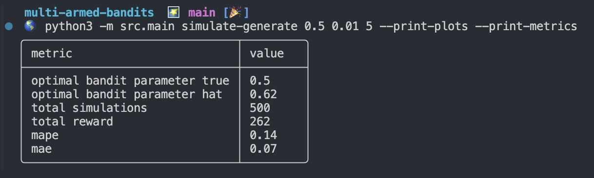

<h1 align="center">
Multi Armed Bandits (MAB).
</h1>

Multi-Armed Bandit method of accurately estimating the largest parameter out of a set of candidates.

<h2  align="center">
About
</h2>

<h2  align="center">
Usage
</h2>

